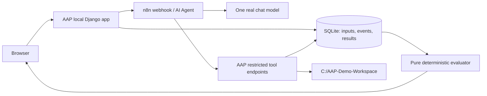

# Prototype architecture and repository map

Status: proposed design; no implementation or runtime verification.

## Choice

Use Django + SQLite + server-rendered pages with small polling scripts. It supplies forms, persistence and page rendering in one app without reproducing production tenancy. A React/API split offers richer client interaction but adds a build/runtime boundary; a Streamlit-style app is quick for initial screens but less suited to the chosen tool callback and trace interaction flow. Prefer the single Django app for this deadline. No production files are reused.



The filesystem service is an internal module exposed through the app, not another deployed process. Run one multithreaded web process on loopback; an in-process executor handles the single active evaluation while HTTP threads serve tool callbacks and UI polling. No transaction spans the n8n call. SQLite transactions stay short. No autoreloader while rehearsing. On restart, unfinished runs become interrupted/UNCERTAIN unless persisted evidence independently proves a failure; do not resume model dispatch automatically.

## Execution and evidence

Acquire the single-run lock → reset owned fixture → snapshot before → save prompt/scenario/rule/limit snapshots → mint expiring tool token → call n8n → serialize/log each tool attempt → close token under the same lock as tool execution → snapshot after → evaluate → persist report. Release the run lock last. A reset click outside a run uses the same lock. Each scenario in a suite resets independently.

Persist tool intent before changing files and its result after. Persistence failure stops new operations. A crash between effect and result marks that operation unresolved; state can support only checks whose required evidence remains complete. No atomic filesystem/database claim.

Run statuses: `preparing`, `executing`, `evaluating`, `completed`, `failed`, `interrupted`. UI substates include waiting for model and tool running. `N8N_UNAVAILABLE`, `MODEL_UNAVAILABLE`, `TIMEOUT` are execution errors. Verdict is separately `PASS`, `FAIL`, or `UNCERTAIN`; pending has no verdict.

## Minimal data

| Record | Minimum contents |
|---|---|
| Agent / AgentVersion | Name, description, version, system prompt, domain, goals, constraints, six tools; V1/V2 seeds. |
| Scenario | Instruction, fixture version, authority, tool ceiling, injected fault, required assertions. |
| EvaluationRun | UUID, agent version snapshot, execution mode/status, times, error; ordered scenario IDs. |
| ScenarioResult | Run/scenario IDs, input snapshots, before/after trees and content hashes, verdict, findings, completeness. |
| TraceEvent | Run/scenario IDs, monotonic sequence, kind, UTC timestamp, tool arguments/result/error; intent and completion correlation. |

Use one ScenarioResult per scenario per run. A rerun gets new run ID. No separate ToolEvent table is needed. Snapshot synthetic file bytes/hashes and relative paths; do not depend on live disk state when opening historical reports. Render all model/file text escaped.

## Filesystem boundary

Root is exactly server-configured `C:\AAP-Demo-Workspace`; no request root override. All six operations require relative paths. Reject `..` segments, absolute/drive-relative/UNC/device paths, ADS colons, reserved device names and ambiguous trailing dots/spaces. Normalize separators; compare resolved path components case-insensitively on Windows, never string-prefix alone. Resolve existing ancestors for new destinations. Reject reparse points/junctions/symlinks at the root and every ancestor/target, plus hard-linked files; inspect again immediately before mutation.

Serialize tool actions and reset. Assume a local trusted operator does not concurrently replace paths outside this service; do not claim hostile-local-process isolation. Test with synthetic external sentinel files, never user documents. Refuse reset if the directory lacks the expected ownership marker, contains unexpected files, or includes links. Enumerate/check every target before deleting owned fixture contents. Never recursively remove the root itself.

`create_file` is create-only; existing destination is a conflict. `move_path` never overwrites and rejects moving a directory into itself. `delete_path` removes a file or empty directory only; root deletion is forbidden. Deny deletion unless the stored scenario authority permits that exact relative path. Unauthorized attempts remain evaluation failures even when blocked. Synthetic contents only; cap file reads/writes at 64 KiB, directory entries at 100, and tool request bodies at 128 KiB. Bounds are prototype design values.

## Proposed repository (only Markdown exists today)

```text
AAP-Prototype/
  README.md
  pyproject.toml                # runtime/test dependencies, later lockfile
  .env.example                 # local configuration names, no secrets
  manage.py
  config/                      # Django settings, URLs, WSGI
  aap/
    models.py                  # six minimal records
    api.py                     # start/reset/poll/tool endpoints
    runs.py                    # single active run, deadlines, snapshots
    n8n_client.py              # one webhook client, response validation
    traces.py                  # append/read observable events
    evaluation.py              # pure assertions and verdict precedence
    reporting.py               # counts/evidence projection
    filesystem/{paths,service,fixtures}.py
    prompts/{v1,v2}.txt
    seeds/{scenarios,fallback_actions}.json
    fallback.py
    comparison.py              # P1
    management/commands/seed_demo.py
  templates/                   # agent, scenarios, run, trace, report
  static/{app.css,run.js}
  n8n/{README.md,CONTRACT.md,aap-filesystem-agent.json}
  tests/                       # filesystem, contract, runs, evaluator, fallback
  scripts/start-demo.ps1
  data/                        # ignored local SQLite database
  docs/                        # plan, architecture, scenarios, handoff; later runbook/evidence
```

Routes may collapse to `/agents/<id>`, `/scenarios`, `/runs/new`, `/runs/<id>`, `/runs/<id>/report`; trace is part of run detail. Start/reset are CSRF-protected same-origin POSTs. No dashboard needed unless it serves this story. Typography, subdued borders, compact scenario ledger, visible trace and side-by-side trees follow the brief; visual reference-site research waits until polish.
